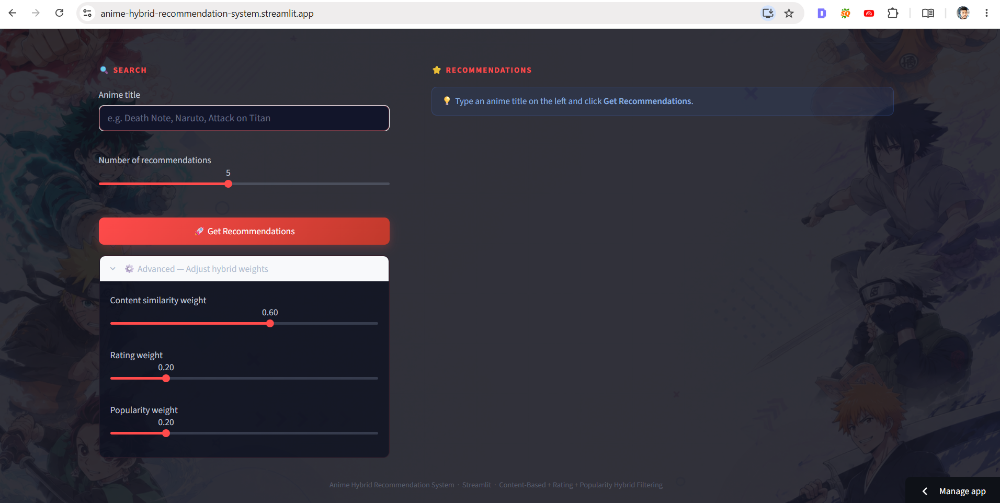
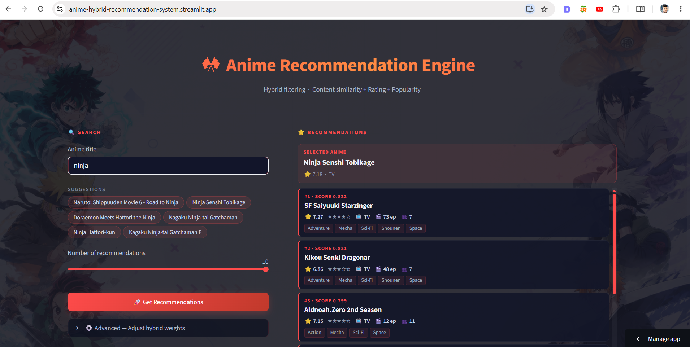
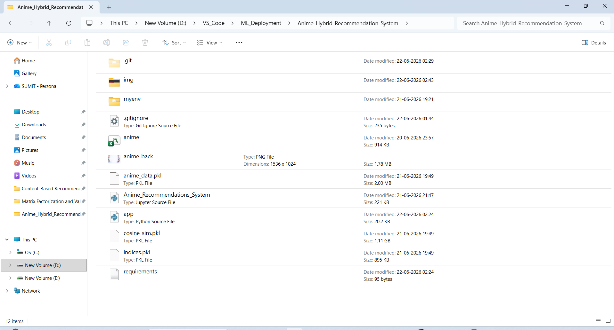

# 🎌 Anime Hybrid Recommendation System

A Hybrid Anime Recommendation System built using Machine Learning, Content-Based Filtering, TF-IDF Vectorization, Cosine Similarity, and Popularity-Based Ranking. The application helps anime enthusiasts discover new anime titles similar to their favorites through an interactive and user-friendly web interface.

🌐 **Live Demo:**
https://anime-hybrid-recommendation-system.streamlit.app/

## 📸 Application Screenshots

### Home Page



### Recommendation Results



### Project Structure



---

## 📌 Project Overview

Finding the next anime to watch can be challenging due to the enormous number of available titles across different genres, themes, and storylines.

This project solves that problem by providing personalized anime recommendations based on the content characteristics of a selected anime. Instead of browsing thousands of anime manually, users can simply enter an anime name and instantly receive highly relevant recommendations.

The recommendation engine combines multiple recommendation signals to improve recommendation quality and relevance.

---

## 🚀 Features

* 🔍 Search anime titles with intelligent suggestions
* 🎯 Get similar anime recommendations instantly
* ⭐ Uses ratings and popularity information for ranking
* 🧠 Hybrid recommendation approach
* 📱 Responsive Streamlit web application
* ⚡ Fast recommendation generation
* 🎨 Modern and user-friendly interface

---

## ❓ Problem Statement

Anime viewers often face the following challenges:

* Too many anime choices available
* Difficulty finding similar anime after finishing a favorite series
* Manual searching consumes time
* Generic rankings do not match individual preferences

This application addresses these issues by automatically recommending anime with similar genres, themes, and content attributes while also considering popularity and rating information.

---

## 🧠 Recommendation Approach

The recommendation system uses a **Hybrid Recommendation Strategy** that combines:

### 1. Content-Based Filtering

Recommendations are generated based on similarities between anime attributes such as:

* Genre
* Anime Type
* Story-related features
* Metadata information

### 2. TF-IDF Vectorization

Textual features are transformed into numerical vectors using:

* TF-IDF (Term Frequency-Inverse Document Frequency)

This allows the system to understand relationships between anime based on their content descriptions and genres.

### 3. Cosine Similarity

Cosine Similarity is used to measure the similarity between anime vectors.

Higher similarity scores indicate that two anime share more characteristics and should be recommended together.

### 4. Popularity-Based Ranking

To improve recommendation quality, popularity metrics and community engagement information are incorporated into the ranking process.

### 5. Rating-Based Scoring

User ratings are used as an additional signal to prioritize higher-quality recommendations.

---

## 🏗️ Machine Learning Pipeline

```text
Anime Dataset
      ↓
Data Cleaning
      ↓
Feature Engineering
      ↓
TF-IDF Vectorization
      ↓
Cosine Similarity Matrix
      ↓
Hybrid Scoring
      ↓
Recommendation Engine
      ↓
Streamlit Web Application
```

---

## 🛠️ Technologies Used

### Programming Language

* Python

### Data Processing

* Pandas
* NumPy

### Machine Learning

* Scikit-Learn
* TF-IDF Vectorizer
* Cosine Similarity

### Model Storage

* Pickle

### Deployment & Hosting

* Streamlit Cloud
* Hugging Face Dataset Repository

### Development Tools

* Jupyter Notebook
* VS Code
* Git
* GitHub

---

## 📂 Project Structure

```text
Anime-Hybrid-Recommendation-System/
│
├── app.py
├── anime.csv
├── anime_back.png
├── Anime_Recommendations_System.ipynb
├── requirements.txt
├── .gitignore
│
└── Hugging Face Dataset
    ├── anime_data.pkl
    ├── cosine_sim.pkl
    └── indices.pkl
```

---

## ☁️ Deployment Architecture

Large machine learning model files are stored on Hugging Face to keep the GitHub repository lightweight and deployment-friendly.

```text
GitHub Repository
        ↓
Streamlit Cloud
        ↓
Downloads Model Files
        ↓
Hugging Face Dataset Storage
        ↓
Recommendation Engine
```

This architecture enables efficient deployment without storing large model files directly inside the GitHub repository.

## 🎯 Use Cases

* Anime enthusiasts looking for new anime to watch
* Recommendation system learning projects
* Machine Learning portfolio projects
* Demonstration of Content-Based Filtering systems
* Streamlit deployment examples
* Hybrid recommendation engine implementation

---

## 📈 Future Improvements

* Collaborative Filtering
* User Authentication
* Anime Posters and Images
* Personalized User Profiles
* Deep Learning Recommendation Models
* Real-Time Recommendation API
* User Rating Feedback System

---

## 🤝 Connect With Me

**Sumit Ghodke**

LinkedIn:
[Sumit Ghodke](https://www.linkedin.com/in/sumit-ghodke-a45a82205/)

---

⭐ If you found this project useful, consider giving the repository a star.
